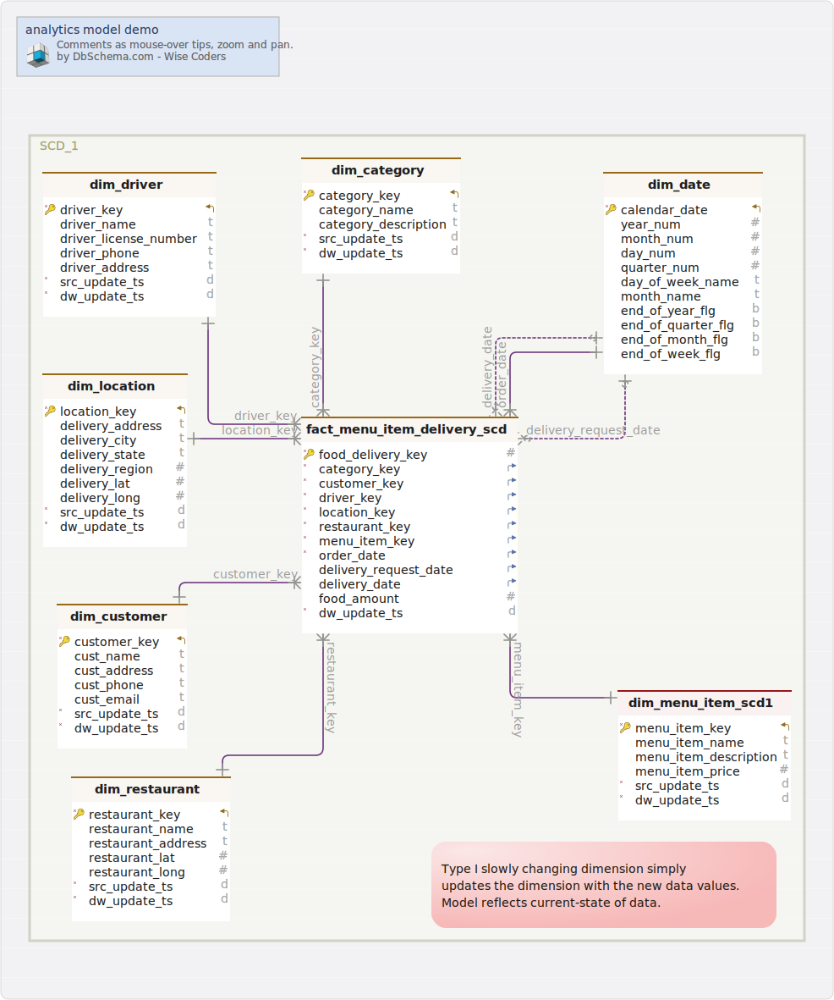

#analytics model demo
Generated using [DbSchema](https://dbschema.com)

## Layouts

1. [transactional_model](#%20transactional\_model)
2. [grain-delivery_date](#%20grain-delivery\_date)
3. [grain-menu_item_date](#%20grain-menu\_item\_date)
4. [slowly changing dimension 1](#%20slowly%20changing%20dimension%201)
5. [slowly changing dimension 2](#%20slowly%20changing%20dimension%202)
6. [Borrow concepts from Data Vault 2.0](#%20borrow%20concepts%20from%20data%20vault%202.0)

## Tables

1. [analytics.dim_category](#table%20analytics.dim\_category)  (  [2](2)  [3](3)  [4](4)  [5](5) )
2. [analytics.dim_customer](#table%20analytics.dim\_customer)  (  [2](2)  [3](3)  [4](4)  [5](5) )
3. [analytics.dim_date](#table%20analytics.dim\_date)  (  [2](2)  [3](3)  [4](4)  [5](5) )
4. [analytics.dim_driver](#table%20analytics.dim\_driver)  (  [2](2)  [3](3)  [4](4)  [5](5) )
5. [analytics.dim_location](#table%20analytics.dim\_location)  (  [2](2)  [3](3)  [4](4)  [5](5) )
6. [analytics.dim_menu_item](#table%20analytics.dim\_menu\_item)  (  [3](3) )
7. [analytics.dim_menu_item_scd1](#table%20analytics.dim\_menu\_item\_scd1)  (  [4](4) )
8. [analytics.dim_menu_item_scd2](#table%20analytics.dim\_menu\_item\_scd2)  (  [5](5) )
9. [analytics.dim_restaurant](#table%20analytics.dim\_restaurant)  (  [3](3)  [4](4)  [5](5) )
10. [analytics.fact_category_delivery](#table%20analytics.fact\_category\_delivery)  (  [2](2) )
11. [analytics.fact_menu_item_delivery](#table%20analytics.fact\_menu\_item\_delivery)  (  [3](3) )
12. [analytics.fact_menu_item_delivery_scd](#table%20analytics.fact\_menu\_item\_delivery\_scd)  (  [4](4)  [5](5) )
13. [analytics_dv.dim_category](#table%20analytics\_dv.dim\_category)  (  [6](6) )
14. [analytics_dv.dim_customer](#table%20analytics\_dv.dim\_customer)  (  [6](6) )
15. [analytics_dv.dim_date](#table%20analytics\_dv.dim\_date)  (  [6](6) )
16. [analytics_dv.dim_driver](#table%20analytics\_dv.dim\_driver)  (  [6](6) )
17. [analytics_dv.dim_location](#table%20analytics\_dv.dim\_location)  (  [6](6) )
18. [analytics_dv.dim_menu_item_scd2](#table%20analytics\_dv.dim\_menu\_item\_scd2)  (  [6](6) )
19. [analytics_dv.dim_restaurant](#table%20analytics\_dv.dim\_restaurant)  (  [6](6) )
20. [analytics_dv.fact_menu_item_delivery](#table%20analytics\_dv.fact\_menu\_item\_delivery)  (  [6](6) )
21. [transaction_concept.category](#table%20transaction\_concept.category)  (  [1](1) )
22. [transaction_concept.customer](#table%20transaction\_concept.customer)  (  [1](1) )
23. [transaction_concept.customer_delivery_location](#table%20transaction\_concept.customer\_delivery\_location)  (  [1](1) )
24. [transaction_concept.customer_order](#table%20transaction\_concept.customer\_order)  (  [1](1) )
25. [transaction_concept.delivery](#table%20transaction\_concept.delivery)  (  [1](1) )
26. [transaction_concept.delivery_location](#table%20transaction\_concept.delivery\_location)  (  [1](1) )
27. [transaction_concept.driver](#table%20transaction\_concept.driver)  (  [1](1) )
28. [transaction_concept.menu_item](#table%20transaction\_concept.menu\_item)  (  [1](1) )
29. [transaction_concept.order](#table%20transaction\_concept.order)  (  [1](1) )
30. [transaction_concept.restaurant](#table%20transaction\_concept.restaurant)  (  [1](1) )

### transactional_model
[Index](#legend) [Next](# grain-delivery\_date) 

### Table transaction_concept.category 
food categories

|Idx |Name |Data Type |
|---|---|---|
| * &#128273;  &#11019; | category\_id| integer  |
|  | category\_name| varchar(100)  |
|  | category\_description| varchar(1000)  |
| * | update\_ts| timestamp  |

### Table transaction_concept.customer 
customers of the service

|Idx |Name |Data Type |
|---|---|---|
| * &#128273;  &#11019; | customer\_id| integer  |
|  | cust\_name| varchar(100)  |
|  | cust\_address| varchar(100)  |
|  | cust\_phone| varchar  |
|  | cust\_email| varchar  |
| * | update\_ts| timestamp  |

### Table transaction_concept.customer_delivery_location 
associative table between customer and delivery location

|Idx |Name |Data Type |
|---|---|---|
| * &#128273;  | customer\_deliver\_location\_id| integer  |
| * &#11016; | customer\_id| integer  |
| * &#11016; | delivery\_location\_id| integer  |
| * | update\_ts| timestamp  |

##### Foreign Keys
|Type |Name |On |
|---|---|---|
|  | fk_customer_delivery_location_customer | ( customer\_id ) ref [transaction\_concept.customer](#customer) (customer\_id) |
|  | fk_customer_delivery_location_delivery_location | ( delivery\_location\_id ) ref [transaction\_concept.delivery\_location](#delivery\_location) (delivery\_location\_id) |

### Table transaction_concept.customer_order 
|Idx |Name |Data Type |
|---|---|---|
| * &#128273;  | customer\_order\_id| integer  |
| * &#11016; | customer\_id| integer  |
| * &#11016; | order\_id| integer  |
| * | update\_ts| timestamp  |

##### Foreign Keys
|Type |Name |On |
|---|---|---|
|  | fk_customer_order_customer | ( customer\_id ) ref [transaction\_concept.customer](#customer) (customer\_id) |
|  | fk_customer_order_order | ( order\_id ) ref [transaction\_concept.order](#order) (order\_id) |

### Table transaction_concept.delivery 
|Idx |Name |Data Type |
|---|---|---|
| * &#128273;  &#11019; | delivery\_id| integer  |
| * &#11016; | driver\_id| integer  |
|  | requested\_time| timestamp  |
|  | pick\_up\_time| timestamp  |
|  | delivery\_time| timestamp  |
| * &#11016; | delivery\_location\_id| integer  |
|  | delivery\_fee| double precision  |
|  | tax| double precision  |
|  | tip| double precision  |
| * | update\_ts| timestamp  |

##### Foreign Keys
|Type |Name |On |
|---|---|---|
|  | fk_order_driver_0 | ( driver\_id ) ref [transaction\_concept.driver](#driver) (driver\_id) |
|  | fk_order_delivery_location_0 | ( delivery\_location\_id ) ref [transaction\_concept.delivery\_location](#delivery\_location) (delivery\_location\_id) |

### Table transaction_concept.delivery_location 
|Idx |Name |Data Type |
|---|---|---|
| * &#128273;  &#11019; | delivery\_location\_id| integer  |
|  | delivery\_address| varchar(100)  |
|  | delivery\_city| varchar  |
|  | delivery\_state| varchar  |
|  | delivery\_region| integer  |
|  | delivery\_lat| double precision  |
|  | delivery\_long| double precision  |
| * | update\_ts| timestamp  |

### Table transaction_concept.driver 
|Idx |Name |Data Type |
|---|---|---|
| * &#128273;  &#11019; | driver\_id| integer  |
|  | driver\_name| varchar(100)  |
|  | driver\_license\_number| varchar(20)  |
|  | driver\_phone| varchar  |
|  | driver\_address| varchar(100)  |
| * | update\_ts| timestamp  |

### Table transaction_concept.menu_item 
|Idx |Name |Data Type |
|---|---|---|
| * &#128273;  &#11019; | menu\_item\_id| integer  |
|  | menu\_item\_name| varchar(100)  |
|  | menu\_item\_description| varchar(1000)  |
|  | menu\_item\_price| double precision  |
| * | update\_ts| timestamp  |
| * &#11016; | restaurant\_id| integer  |

##### Foreign Keys
|Type |Name |On |
|---|---|---|
|  | fk_menu_item_restaurant | ( restaurant\_id ) ref [transaction\_concept.restaurant](#restaurant) (restaurant\_id) |

### Table transaction_concept.order 
|Idx |Name |Data Type |
|---|---|---|
| * &#128273;  &#11019; | order\_id| integer  |
| * &#11016; | delivery\_id| integer  |
| &#11016; | menu\_item\_id| integer  |
|  | item\_price| double precision  |
|  | quantity| integer  |
| * | update\_ts| timestamp  |

##### Foreign Keys
|Type |Name |On |
|---|---|---|
|  | fk_order_menu_item | ( menu\_item\_id ) ref [transaction\_concept.menu\_item](#menu\_item) (menu\_item\_id) |
|  | fk_order_delivery | ( delivery\_id ) ref [transaction\_concept.delivery](#delivery) (delivery\_id) |

### Table transaction_concept.restaurant 
|Idx |Name |Data Type |
|---|---|---|
| * &#128273;  &#11019; | restaurant\_id| integer  |
|  | restaurant\_name| varchar(100)  |
|  | restaurant\_address| varchar(100)  |
|  | restaurant\_lat| double precision  |
|  | restaurant\_long| double precision  |
| * | update\_ts| timestamp  |
| * &#11016; | category\_id| integer  |

##### Foreign Keys
|Type |Name |On |
|---|---|---|
|  | fk_restaurant_category | ( category\_id ) ref [transaction\_concept.category](#category) (category\_id) |

### grain-delivery_date
[Prev](# transactional\_model)
[Index](#legend) [Next](# grain-menu\_item\_date) 

### Table analytics.dim_category 
|Idx |Name |Data Type |
|---|---|---|
| * &#128273;  &#11019; | category\_key| integer  |
|  | category\_name| varchar(100)  |
|  | category\_description| varchar(1000)  |
| * | src\_update\_ts| timestamp  |
| * | dw\_update\_ts| timestamp  |

### Table analytics.dim_customer 
|Idx |Name |Data Type |
|---|---|---|
| * &#128273;  &#11019; | customer\_key| integer  |
|  | cust\_name| varchar(100)  |
|  | cust\_address| varchar(100)  |
|  | cust\_phone| varchar  |
|  | cust\_email| varchar  |
| * | src\_update\_ts| timestamp  |
| * | dw\_update\_ts| timestamp  |

### Table analytics.dim_date 
|Idx |Name |Data Type |
|---|---|---|
| * &#128273;  &#11019; | calendar\_date| date  |
|  | year\_num| integer  |
|  | month\_num| integer  |
|  | day\_num| integer  |
|  | quarter\_num| integer  |
|  | day\_of\_week\_name| varchar  |
|  | month\_name| varchar(100)  |
|  | end\_of\_year\_flg| boolean  |
|  | end\_of\_quarter\_flg| boolean  |
|  | end\_of\_month\_flg| boolean  |
|  | end\_of\_week\_flg| boolean  |

### Table analytics.dim_driver 
|Idx |Name |Data Type |
|---|---|---|
| * &#128273;  &#11019; | driver\_key| integer  |
|  | driver\_name| varchar(100)  |
|  | driver\_license\_number| varchar(20)  |
|  | driver\_phone| varchar  |
|  | driver\_address| varchar(100)  |
| * | src\_update\_ts| timestamp  |
| * | dw\_update\_ts| timestamp  |

### Table analytics.dim_location 
|Idx |Name |Data Type |
|---|---|---|
| * &#128273;  &#11019; | location\_key| integer  |
|  | delivery\_address| varchar(100)  |
|  | delivery\_city| varchar  |
|  | delivery\_state| varchar  |
|  | delivery\_region| integer  |
|  | delivery\_lat| double precision  |
|  | delivery\_long| double precision  |
| * | src\_update\_ts| timestamp  |
| * | dw\_update\_ts| timestamp  |

### Table analytics.fact_category_delivery 
|Idx |Name |Data Type |
|---|---|---|
| * &#128273;  | food\_delivery\_key| integer  |
| * &#11016; | category\_key| integer  |
| * &#11016; | customer\_key| integer  |
| * &#11016; | driver\_key| integer  |
| * &#11016; | location\_key| integer  |
| * &#11016; | order\_date| date  |
| &#11016; | delivery\_request\_date| date  |
| &#11016; | delivery\_date| date  |
| * | dw\_update\_ts| timestamp  |
|  | food\_amount| double precision  |
|  | tax\_amount| double precision  |
|  | tip\_amount| double precision  |
|  | delivery\_fee\_amount| double precision  |

##### Foreign Keys
|Type |Name |On |
|---|---|---|
| Vir | fk_fact_food_delivery_dim_category | ( category\_key ) ref [analytics.dim\_category](#dim\_category) (category\_key) |
| Vir | fk_fact_food_delivery_dim_customer | ( customer\_key ) ref [analytics.dim\_customer](#dim\_customer) (customer\_key) |
| Vir | fk_fact_food_delivery_dim_driver | ( driver\_key ) ref [analytics.dim\_driver](#dim\_driver) (driver\_key) |
| Vir | fk_fact_food_delivery_dim_location | ( location\_key ) ref [analytics.dim\_location](#dim\_location) (location\_key) |
| Vir | fk_fact_food_delivery_dim_menu_item | (  ) ref [analytics.dim\_menu\_item](#dim\_menu\_item) () |
| Vir | fk_fact_food_delivery_dim_date | ( order\_date ) ref [analytics.dim\_date](#dim\_date) (calendar\_date) |
| Vir | fk_fact_food_delivery_dim_date_0 | ( delivery\_request\_date ) ref [analytics.dim\_date](#dim\_date) (calendar\_date) |
| Vir | fk_fact_food_delivery_dim_date_1 | ( delivery\_date ) ref [analytics.dim\_date](#dim\_date) (calendar\_date) |
| Vir | fk_fact_food_delivery_dim_restaurant | (  ) ref [analytics.dim\_restaurant](#dim\_restaurant) () |

### grain-menu_item_date
[Prev](# grain-delivery\_date)
[Index](#legend) [Next](# slowly%20changing%20dimension%201) 

### Table analytics.dim_category 
|Idx |Name |Data Type |
|---|---|---|
| * &#128273;  &#11019; | category\_key| integer  |
|  | category\_name| varchar(100)  |
|  | category\_description| varchar(1000)  |
| * | src\_update\_ts| timestamp  |
| * | dw\_update\_ts| timestamp  |

### Table analytics.dim_customer 
|Idx |Name |Data Type |
|---|---|---|
| * &#128273;  &#11019; | customer\_key| integer  |
|  | cust\_name| varchar(100)  |
|  | cust\_address| varchar(100)  |
|  | cust\_phone| varchar  |
|  | cust\_email| varchar  |
| * | src\_update\_ts| timestamp  |
| * | dw\_update\_ts| timestamp  |

### Table analytics.dim_date 
|Idx |Name |Data Type |
|---|---|---|
| * &#128273;  &#11019; | calendar\_date| date  |
|  | year\_num| integer  |
|  | month\_num| integer  |
|  | day\_num| integer  |
|  | quarter\_num| integer  |
|  | day\_of\_week\_name| varchar  |
|  | month\_name| varchar(100)  |
|  | end\_of\_year\_flg| boolean  |
|  | end\_of\_quarter\_flg| boolean  |
|  | end\_of\_month\_flg| boolean  |
|  | end\_of\_week\_flg| boolean  |

### Table analytics.dim_driver 
|Idx |Name |Data Type |
|---|---|---|
| * &#128273;  &#11019; | driver\_key| integer  |
|  | driver\_name| varchar(100)  |
|  | driver\_license\_number| varchar(20)  |
|  | driver\_phone| varchar  |
|  | driver\_address| varchar(100)  |
| * | src\_update\_ts| timestamp  |
| * | dw\_update\_ts| timestamp  |

### Table analytics.dim_location 
|Idx |Name |Data Type |
|---|---|---|
| * &#128273;  &#11019; | location\_key| integer  |
|  | delivery\_address| varchar(100)  |
|  | delivery\_city| varchar  |
|  | delivery\_state| varchar  |
|  | delivery\_region| integer  |
|  | delivery\_lat| double precision  |
|  | delivery\_long| double precision  |
| * | src\_update\_ts| timestamp  |
| * | dw\_update\_ts| timestamp  |

### Table analytics.dim_menu_item 
|Idx |Name |Data Type |
|---|---|---|
| * &#128273;  &#11019; | menu\_item\_key| integer  |
|  | menu\_item\_name| varchar(100)  |
|  | menu\_item\_description| varchar(1000)  |
|  | menu\_item\_price| double precision  |
| * | src\_update\_ts| timestamp  |
| * | dw\_update\_ts| timestamp  |
| * | effective\_start\_ts| timestamp  |
| * | effective\_end\_ts| timestamp  |

### Table analytics.dim_restaurant 
|Idx |Name |Data Type |
|---|---|---|
| * &#128273;  &#11019; | restaurant\_key| integer  |
|  | restaurant\_name| varchar(100)  |
|  | restaurant\_address| varchar(100)  |
|  | restaurant\_lat| double precision  |
|  | restaurant\_long| double precision  |
| * | src\_update\_ts| timestamp  |
| * | dw\_update\_ts| timestamp  |

### Table analytics.fact_menu_item_delivery 
|Idx |Name |Data Type |Description |
|---|---|---|---|
| * &#128273;  | food\_delivery\_key| integer  |  |
| * &#11016; | category\_key| integer  |  |
| * &#11016; | customer\_key| integer  |  |
| * &#11016; | driver\_key| integer  |  |
| * &#11016; | location\_key| integer  |  |
| * &#11016; | restaurant\_key| integer  |  |
| * &#11016; | menu\_item\_key| integer  |  |
| * &#11016; | order\_date| date  |  |
| &#11016; | delivery\_request\_date| date  |  |
| &#11016; | delivery\_date| date  |  |
|  | food\_amount| double precision  |  |
|  | ***tax\_amount***| double precision  | This field is at the wrong grain!  We only have data for it at the delivery level. |
|  | ***tip\_amount***| double precision  | This field is at the wrong grain!  We only have data for it at the delivery level. |
|  | ***delivery\_fee\_amount***| double precision  | This field is at the wrong grain!  We only have data for it at the delivery level. |
| * | dw\_update\_ts| timestamp  |  |

##### Foreign Keys
|Type |Name |On |
|---|---|---|
| Vir | fk_fact_food_delivery_dim_category_0 | ( category\_key ) ref [analytics.dim\_category](#dim\_category) (category\_key) |
| Vir | fk_fact_food_delivery_dim_customer_0 | ( customer\_key ) ref [analytics.dim\_customer](#dim\_customer) (customer\_key) |
| Vir | fk_fact_food_delivery_dim_driver_0 | ( driver\_key ) ref [analytics.dim\_driver](#dim\_driver) (driver\_key) |
| Vir | fk_fact_food_delivery_dim_location_0 | ( location\_key ) ref [analytics.dim\_location](#dim\_location) (location\_key) |
| Vir | fk_fact_food_delivery_dim_menu_item_0 | ( menu\_item\_key ) ref [analytics.dim\_menu\_item](#dim\_menu\_item) (menu\_item\_key) |
| Vir | fk_fact_food_delivery_dim_date_2 | ( order\_date ) ref [analytics.dim\_date](#dim\_date) (calendar\_date) |
| Vir | fk_fact_food_delivery_dim_date_3 | ( delivery\_request\_date ) ref [analytics.dim\_date](#dim\_date) (calendar\_date) |
| Vir | fk_fact_food_delivery_dim_date_4 | ( delivery\_date ) ref [analytics.dim\_date](#dim\_date) (calendar\_date) |
| Vir | fk_fact_food_delivery_dim_restaurant_0 | ( restaurant\_key ) ref [analytics.dim\_restaurant](#dim\_restaurant) (restaurant\_key) |

### slowly changing dimension 1
[Prev](# grain-menu\_item\_date)
[Index](#legend) [Next](# slowly%20changing%20dimension%202) 

### Table analytics.dim_category 
|Idx |Name |Data Type |
|---|---|---|
| * &#128273;  &#11019; | category\_key| integer  |
|  | category\_name| varchar(100)  |
|  | category\_description| varchar(1000)  |
| * | src\_update\_ts| timestamp  |
| * | dw\_update\_ts| timestamp  |

### Table analytics.dim_customer 
|Idx |Name |Data Type |
|---|---|---|
| * &#128273;  &#11019; | customer\_key| integer  |
|  | cust\_name| varchar(100)  |
|  | cust\_address| varchar(100)  |
|  | cust\_phone| varchar  |
|  | cust\_email| varchar  |
| * | src\_update\_ts| timestamp  |
| * | dw\_update\_ts| timestamp  |

### Table analytics.dim_date 
|Idx |Name |Data Type |
|---|---|---|
| * &#128273;  &#11019; | calendar\_date| date  |
|  | year\_num| integer  |
|  | month\_num| integer  |
|  | day\_num| integer  |
|  | quarter\_num| integer  |
|  | day\_of\_week\_name| varchar  |
|  | month\_name| varchar(100)  |
|  | end\_of\_year\_flg| boolean  |
|  | end\_of\_quarter\_flg| boolean  |
|  | end\_of\_month\_flg| boolean  |
|  | end\_of\_week\_flg| boolean  |

### Table analytics.dim_driver 
|Idx |Name |Data Type |
|---|---|---|
| * &#128273;  &#11019; | driver\_key| integer  |
|  | driver\_name| varchar(100)  |
|  | driver\_license\_number| varchar(20)  |
|  | driver\_phone| varchar  |
|  | driver\_address| varchar(100)  |
| * | src\_update\_ts| timestamp  |
| * | dw\_update\_ts| timestamp  |

### Table analytics.dim_location 
|Idx |Name |Data Type |
|---|---|---|
| * &#128273;  &#11019; | location\_key| integer  |
|  | delivery\_address| varchar(100)  |
|  | delivery\_city| varchar  |
|  | delivery\_state| varchar  |
|  | delivery\_region| integer  |
|  | delivery\_lat| double precision  |
|  | delivery\_long| double precision  |
| * | src\_update\_ts| timestamp  |
| * | dw\_update\_ts| timestamp  |

### Table analytics.dim_menu_item_scd1 
|Idx |Name |Data Type |
|---|---|---|
| * &#128273;  &#11019; | menu\_item\_key| integer  |
|  | menu\_item\_name| varchar(100)  |
|  | menu\_item\_description| varchar(1000)  |
|  | menu\_item\_price| double precision  |
| * | src\_update\_ts| timestamp  |
| * | dw\_update\_ts| timestamp  |

### Table analytics.dim_restaurant 
|Idx |Name |Data Type |
|---|---|---|
| * &#128273;  &#11019; | restaurant\_key| integer  |
|  | restaurant\_name| varchar(100)  |
|  | restaurant\_address| varchar(100)  |
|  | restaurant\_lat| double precision  |
|  | restaurant\_long| double precision  |
| * | src\_update\_ts| timestamp  |
| * | dw\_update\_ts| timestamp  |

### Table analytics.fact_menu_item_delivery_scd 
|Idx |Name |Data Type |
|---|---|---|
| * &#128273;  | food\_delivery\_key| integer  |
| * &#11016; | category\_key| integer  |
| * &#11016; | customer\_key| integer  |
| * &#11016; | driver\_key| integer  |
| * &#11016; | location\_key| integer  |
| * &#11016; | restaurant\_key| integer  |
| * &#11016; | menu\_item\_key| integer  |
| * &#11016; | order\_date| date  |
| &#11016; | delivery\_request\_date| date  |
| &#11016; | delivery\_date| date  |
|  | food\_amount| double precision  |
| * | dw\_update\_ts| timestamp  |

##### Foreign Keys
|Type |Name |On |
|---|---|---|
| Vir | fk_fact_food_delivery_dim_category_1 | ( category\_key ) ref [analytics.dim\_category](#dim\_category) (category\_key) |
| Vir | fk_fact_food_delivery_dim_customer_1 | ( customer\_key ) ref [analytics.dim\_customer](#dim\_customer) (customer\_key) |
| Vir | fk_fact_food_delivery_dim_driver_1 | ( driver\_key ) ref [analytics.dim\_driver](#dim\_driver) (driver\_key) |
| Vir | fk_fact_food_delivery_dim_location_1 | ( location\_key ) ref [analytics.dim\_location](#dim\_location) (location\_key) |
| Vir | fk_fact_food_delivery_dim_menu_item_1 | ( menu\_item\_key ) ref [analytics.dim\_menu\_item\_scd1](#dim\_menu\_item\_scd1) (menu\_item\_key) |
| Vir | fk_fact_food_delivery_dim_date_5 | ( order\_date ) ref [analytics.dim\_date](#dim\_date) (calendar\_date) |
| Vir | fk_fact_food_delivery_dim_date_6 | ( delivery\_request\_date ) ref [analytics.dim\_date](#dim\_date) (calendar\_date) |
| Vir | fk_fact_food_delivery_dim_date_7 | ( delivery\_date ) ref [analytics.dim\_date](#dim\_date) (calendar\_date) |
| Vir | fk_fact_food_delivery_dim_restaurant_1 | ( restaurant\_key ) ref [analytics.dim\_restaurant](#dim\_restaurant) (restaurant\_key) |
| Vir | fk_fact_menu_item_delivery_scd_dim_menu_item_scd2 | ( menu\_item\_key ) ref [analytics.dim\_menu\_item\_scd2](#dim\_menu\_item\_scd2) (menu\_item\_key) |

### slowly changing dimension 2
[Prev](# slowly%20changing%20dimension%201)
[Index](#legend) [Next](# borrow%20concepts%20from%20data%20vault%202.0) 

### Table analytics.dim_category 
|Idx |Name |Data Type |
|---|---|---|
| * &#128273;  &#11019; | category\_key| integer  |
|  | category\_name| varchar(100)  |
|  | category\_description| varchar(1000)  |
| * | src\_update\_ts| timestamp  |
| * | dw\_update\_ts| timestamp  |

### Table analytics.dim_customer 
|Idx |Name |Data Type |
|---|---|---|
| * &#128273;  &#11019; | customer\_key| integer  |
|  | cust\_name| varchar(100)  |
|  | cust\_address| varchar(100)  |
|  | cust\_phone| varchar  |
|  | cust\_email| varchar  |
| * | src\_update\_ts| timestamp  |
| * | dw\_update\_ts| timestamp  |

### Table analytics.dim_date 
|Idx |Name |Data Type |
|---|---|---|
| * &#128273;  &#11019; | calendar\_date| date  |
|  | year\_num| integer  |
|  | month\_num| integer  |
|  | day\_num| integer  |
|  | quarter\_num| integer  |
|  | day\_of\_week\_name| varchar  |
|  | month\_name| varchar(100)  |
|  | end\_of\_year\_flg| boolean  |
|  | end\_of\_quarter\_flg| boolean  |
|  | end\_of\_month\_flg| boolean  |
|  | end\_of\_week\_flg| boolean  |

### Table analytics.dim_driver 
|Idx |Name |Data Type |
|---|---|---|
| * &#128273;  &#11019; | driver\_key| integer  |
|  | driver\_name| varchar(100)  |
|  | driver\_license\_number| varchar(20)  |
|  | driver\_phone| varchar  |
|  | driver\_address| varchar(100)  |
| * | src\_update\_ts| timestamp  |
| * | dw\_update\_ts| timestamp  |

### Table analytics.dim_location 
|Idx |Name |Data Type |
|---|---|---|
| * &#128273;  &#11019; | location\_key| integer  |
|  | delivery\_address| varchar(100)  |
|  | delivery\_city| varchar  |
|  | delivery\_state| varchar  |
|  | delivery\_region| integer  |
|  | delivery\_lat| double precision  |
|  | delivery\_long| double precision  |
| * | src\_update\_ts| timestamp  |
| * | dw\_update\_ts| timestamp  |

### Table analytics.dim_menu_item_scd2 
|Idx |Name |Data Type |
|---|---|---|
| * &#128273;  &#11019; | menu\_item\_key| integer  |
|  | menu\_item\_name| varchar(100)  |
|  | menu\_item\_description| varchar(1000)  |
|  | menu\_item\_price| double precision  |
| * | src\_update\_ts| timestamp  |
| * | dw\_update\_ts| timestamp  |
| * &#128273;  | effective\_start\_ts| timestamp  |
| * | effective\_end\_ts| timestamp  |

### Table analytics.dim_restaurant 
|Idx |Name |Data Type |
|---|---|---|
| * &#128273;  &#11019; | restaurant\_key| integer  |
|  | restaurant\_name| varchar(100)  |
|  | restaurant\_address| varchar(100)  |
|  | restaurant\_lat| double precision  |
|  | restaurant\_long| double precision  |
| * | src\_update\_ts| timestamp  |
| * | dw\_update\_ts| timestamp  |

### Table analytics.fact_menu_item_delivery_scd 
|Idx |Name |Data Type |
|---|---|---|
| * &#128273;  | food\_delivery\_key| integer  |
| * &#11016; | category\_key| integer  |
| * &#11016; | customer\_key| integer  |
| * &#11016; | driver\_key| integer  |
| * &#11016; | location\_key| integer  |
| * &#11016; | restaurant\_key| integer  |
| * &#11016; | menu\_item\_key| integer  |
| * &#11016; | order\_date| date  |
| &#11016; | delivery\_request\_date| date  |
| &#11016; | delivery\_date| date  |
|  | food\_amount| double precision  |
| * | dw\_update\_ts| timestamp  |

##### Foreign Keys
|Type |Name |On |
|---|---|---|
| Vir | fk_fact_food_delivery_dim_category_1 | ( category\_key ) ref [analytics.dim\_category](#dim\_category) (category\_key) |
| Vir | fk_fact_food_delivery_dim_customer_1 | ( customer\_key ) ref [analytics.dim\_customer](#dim\_customer) (customer\_key) |
| Vir | fk_fact_food_delivery_dim_driver_1 | ( driver\_key ) ref [analytics.dim\_driver](#dim\_driver) (driver\_key) |
| Vir | fk_fact_food_delivery_dim_location_1 | ( location\_key ) ref [analytics.dim\_location](#dim\_location) (location\_key) |
| Vir | fk_fact_food_delivery_dim_menu_item_1 | ( menu\_item\_key ) ref [analytics.dim\_menu\_item\_scd1](#dim\_menu\_item\_scd1) (menu\_item\_key) |
| Vir | fk_fact_food_delivery_dim_date_5 | ( order\_date ) ref [analytics.dim\_date](#dim\_date) (calendar\_date) |
| Vir | fk_fact_food_delivery_dim_date_6 | ( delivery\_request\_date ) ref [analytics.dim\_date](#dim\_date) (calendar\_date) |
| Vir | fk_fact_food_delivery_dim_date_7 | ( delivery\_date ) ref [analytics.dim\_date](#dim\_date) (calendar\_date) |
| Vir | fk_fact_food_delivery_dim_restaurant_1 | ( restaurant\_key ) ref [analytics.dim\_restaurant](#dim\_restaurant) (restaurant\_key) |
| Vir | fk_fact_menu_item_delivery_scd_dim_menu_item_scd2 | ( menu\_item\_key ) ref [analytics.dim\_menu\_item\_scd2](#dim\_menu\_item\_scd2) (menu\_item\_key) |

### Borrow concepts from Data Vault 2.0
[Prev](# slowly%20changing%20dimension%202)
[Index](#legend) 

### Table analytics_dv.dim_category 
|Idx |Name |Data Type |
|---|---|---|
| * &#128273;  &#11019; | category\_hkey| varchar(32)  |
|  | category\_name| varchar(100)  |
|  | category\_description| varchar(1000)  |
| * | src\_update\_ts| timestamp  |
| * | dw\_update\_ts| timestamp  |

### Table analytics_dv.dim_customer 
|Idx |Name |Data Type |
|---|---|---|
| * &#128273;  &#11019; | customer\_hkey| varchar(32)  |
|  | cust\_name| varchar(100)  |
|  | cust\_address| varchar(100)  |
|  | cust\_phone| varchar  |
|  | cust\_email| varchar  |
| * | src\_update\_ts| timestamp  |
| * | dw\_update\_ts| timestamp  |

### Table analytics_dv.dim_date 
|Idx |Name |Data Type |
|---|---|---|
| * &#128273;  &#11019; | calendar\_date| date  |
|  | year\_num| integer  |
|  | month\_num| integer  |
|  | day\_num| integer  |
|  | quarter\_num| integer  |
|  | day\_of\_week\_name| varchar  |
|  | month\_name| varchar(100)  |
|  | end\_of\_year\_flg| boolean  |
|  | end\_of\_quarter\_flg| boolean  |
|  | end\_of\_month\_flg| boolean  |
|  | end\_of\_week\_flg| boolean  |

### Table analytics_dv.dim_driver 
|Idx |Name |Data Type |
|---|---|---|
| * &#128273;  &#11019; | driver\_hkey| varchar(32)  |
|  | driver\_name| varchar(100)  |
|  | driver\_license\_number| varchar(20)  |
|  | driver\_phone| varchar  |
|  | driver\_address| varchar(100)  |
| * | src\_update\_ts| timestamp  |
| * | dw\_update\_ts| timestamp  |

### Table analytics_dv.dim_location 
|Idx |Name |Data Type |
|---|---|---|
| * &#128273;  &#11019; | location\_hkey| varchar(32)  |
|  | delivery\_address| varchar(100)  |
|  | delivery\_city| varchar  |
|  | delivery\_state| varchar  |
|  | delivery\_region| integer  |
|  | delivery\_lat| double precision  |
|  | delivery\_long| double precision  |
| * | src\_update\_ts| timestamp  |
| * | dw\_update\_ts| timestamp  |

### Table analytics_dv.dim_menu_item_scd2 
|Idx |Name |Data Type |
|---|---|---|
| * &#128273;  &#11019; | menu\_item\_hkey| varchar(32)  |
|  | menu\_item\_name| varchar(100)  |
|  | menu\_item\_description| varchar(1000)  |
|  | menu\_item\_price| double precision  |
| * | src\_update\_ts| timestamp  |
| * | dw\_update\_ts| timestamp  |
| * | effective\_start\_ts| timestamp  |
| * | effective\_end\_ts| timestamp  |

### Table analytics_dv.dim_restaurant 
|Idx |Name |Data Type |
|---|---|---|
| * &#128273;  &#11019; | restaurant\_hkey| varchar(32)  |
|  | restaurant\_name| varchar(100)  |
|  | restaurant\_address| varchar(100)  |
|  | restaurant\_lat| double precision  |
|  | restaurant\_long| double precision  |
| * | src\_update\_ts| timestamp  |
| * | dw\_update\_ts| timestamp  |

### Table analytics_dv.fact_menu_item_delivery 
|Idx |Name |Data Type |
|---|---|---|
| * &#128273;  | food\_delivery\_hkey| varchar(32)  |
| * &#11016; | category\_hkey| varchar(32)  |
| * &#11016; | customer\_hkey| varchar(32)  |
| * &#11016; | driver\_hkey| varchar(32)  |
| * &#11016; | location\_hkey| varchar(32)  |
| * &#11016; | restaurant\_hkey| varchar(32)  |
| * &#11016; | menu\_item\_hkey| varchar(32)  |
| * &#11016; | order\_date| date  |
| &#11016; | delivery\_request\_date| date  |
| &#11016; | delivery\_date| date  |
|  | food\_amount| double precision  |
| * | dw\_update\_ts| timestamp  |

##### Foreign Keys
|Type |Name |On |
|---|---|---|
| Vir | fk_fact_food_delivery_dim_category_1 | ( category\_hkey ) ref [analytics\_dv.dim\_category](#dim\_category) (category\_hkey) |
| Vir | fk_fact_food_delivery_dim_customer_1 | ( customer\_hkey ) ref [analytics\_dv.dim\_customer](#dim\_customer) (customer\_hkey) |
| Vir | fk_fact_food_delivery_dim_driver_1 | ( driver\_hkey ) ref [analytics\_dv.dim\_driver](#dim\_driver) (driver\_hkey) |
| Vir | fk_fact_food_delivery_dim_location_1 | ( location\_hkey ) ref [analytics\_dv.dim\_location](#dim\_location) (location\_hkey) |
| Vir | fk_fact_food_delivery_dim_date_5 | ( order\_date ) ref [analytics\_dv.dim\_date](#dim\_date) (calendar\_date) |
| Vir | fk_fact_food_delivery_dim_date_6 | ( delivery\_request\_date ) ref [analytics\_dv.dim\_date](#dim\_date) (calendar\_date) |
| Vir | fk_fact_food_delivery_dim_date_7 | ( delivery\_date ) ref [analytics\_dv.dim\_date](#dim\_date) (calendar\_date) |
| Vir | fk_fact_food_delivery_dim_restaurant_1 | ( restaurant\_hkey ) ref [analytics\_dv.dim\_restaurant](#dim\_restaurant) (restaurant\_hkey) |
| Vir | fk_fact_menu_item_delivery_scd_dim_menu_item_scd2 | ( menu\_item\_hkey ) ref [analytics\_dv.dim\_menu\_item\_scd2](#dim\_menu\_item\_scd2) (menu\_item\_hkey) |

